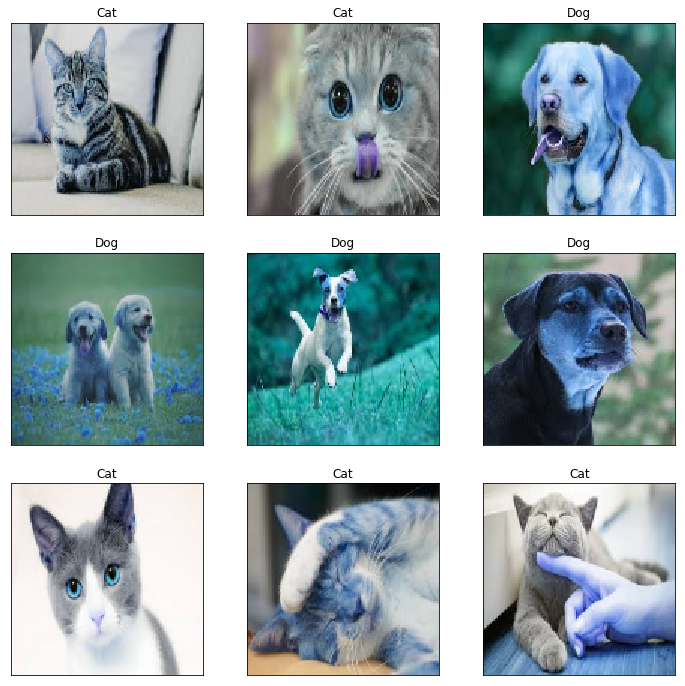

# Cat Vs Dog using keras CNN

this project is made on the datasets from [Kaggle](https://www.kaggle.com/c/dogs-vs-cats)
using keras CNN to classify dog from cat images 

you can find the training in Cat vs dog jupyter notebook 
the model in saved in  model.json
and the weights in model.h5 
and in the loading the weights notebook  you can load the the model and weights to test them

## usage 
put the images you want to classify in the images directory 
in the command line write   python run.py    or click on the python script 'run.py'
after that all the images will be renamed and moved to the file output
